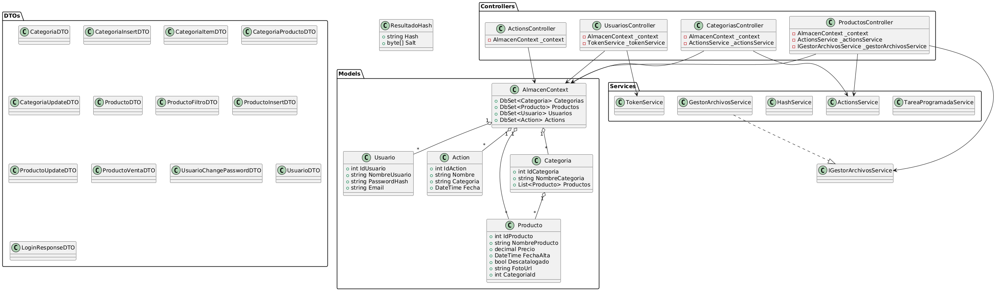
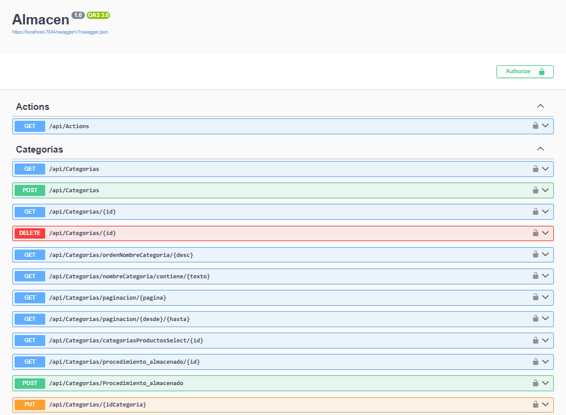
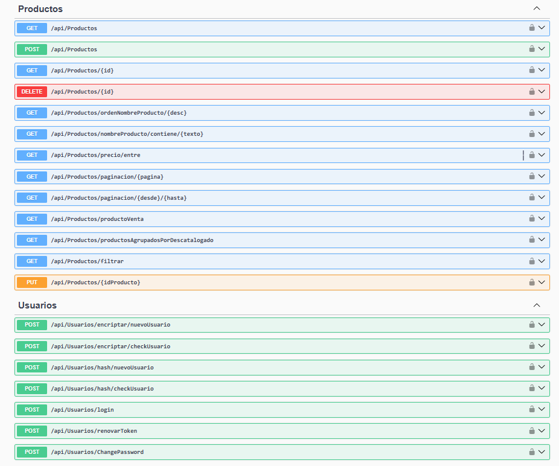
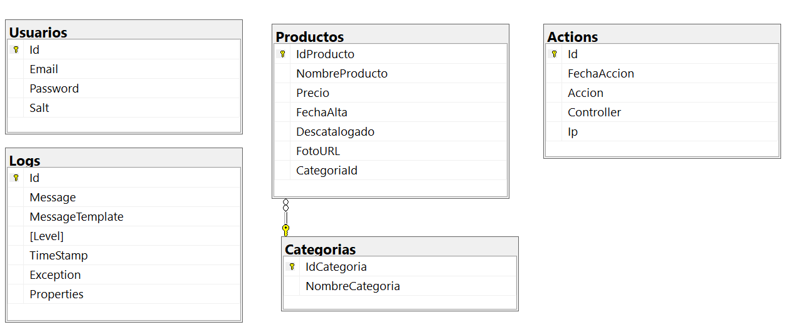

## Almacen

**Almacen** an ASP.NET Core Web API for inventory management, enfocado en la gestión de categorías y productos. Controllers for CRUD operations and queries for Actions, Categories, Products, and Users are presented, with example endpoints that handle retrieving, adding, updating, and deleting data, including features such as JWT authentication, password encryption/hashing, file handling, and stored procedure execution. In addition, exception filters and logging middleware are configured, and Serilog configuration for event logging, database setup and SQL scripts for table creation, and Docker and docker-compose files for containerization are included.



Almacen/  
├── Clases/  
│   └── ResultadoHash.cs  
├── Controllers/  
│   ├── ActionsController.cs  
│   ├── CategoriasController.cs  
│   ├── ProductosController.cs  
│   └── UsuariosController.cs  
├── DTOs/  
│   ├── CategoriaDTO.cs  
│   ├── CategoriaInsertDTO.cs  
│   ├── CategoriaItemDTO.cs  
│   ├── CategoriaProductoDTO.cs  
│   ├── CategoriaUpdateDTO.cs  
│   ├── LoginResponseDTO.cs  
│   ├── ProductoDTO.cs  
│   ├── ProductoFiltroDTO.cs  
│   ├── ProductoInsertDTO.cs  
│   ├── ProductoUpdateDTO.cs  
│   ├── ProductoVentaDTO.cs  
│   ├── UsuarioChangePasswordDTO.cs  
│   └── UsuarioDTO.cs  
├── Filters/  
│   └── FiltroDeExcepcion.cs  
├── Middlewares/  
│   └── RegistroYControlMiddleware.cs  
├── Models/  
│   ├── Action.cs  
│   ├── AlmacenContext.cs  
│   ├── Categoria.cs  
│   ├── Producto.cs  
│   └── Usuario.cs  
├── Services/  
│   ├── ActionService.cs  
│   ├── GestorArchivosService.cs  
│   ├── HashService.cs  
│   ├── IGestorArchivosService.cs  
│   ├── TareaProgramadaService.cs  
│   └── TokenService.cs  
├── Validators/  
│   ├── GrupoTipoArchivo.cs  
│   ├── PesoArchivoValidacion.cs  
│   └── TipoArchivoValidacion.cs  
├── Properties/  
│   └── launchSettings.json  
├── wwwroot/  
├── appsettings.json   
├── Program.cs  
└── Almacen.csproj  





## Program
```cs 
var connectionString = builder.Configuration.GetConnectionString("DefaultConnection");

builder.Services.AddDbContext<AlmacenContext>(options =>
    options.UseSqlServer(connectionString)
);
``` 

## appsetting.Development.json
```cs 
{
  "ConnectionStrings": {
    "DefaultConnection": "Data Source=*;Initial Catalog=Almacen;Integrated Security=True;Encrypt=False"
  }
}
``` 



[DeepWiki moraisLuismNet/Almacen](https://deepwiki.com/moraisLuismNet/Almacen)